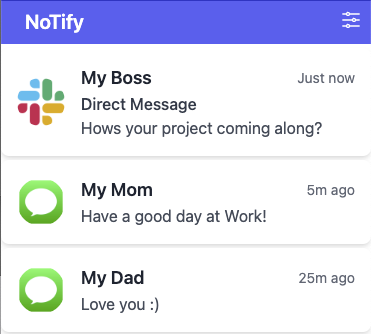
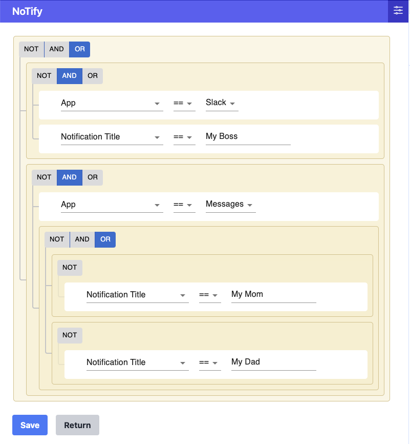

# NoTify - Stop getting distracted at Work!

## You wish you could keep Slack closed

Yes, [Slack is your #1 distraction](https://www.forbes.com/sites/lucianapaulise/2023/05/04/yes-slack-is-your-1-distraction-here-is-how-to-improve-your-productivity/?sh=837f6db3bff8). [Slack is not where deep work happens](https://blog.nuclino.com/slack-is-not-where-deep-work-happens). [Slack is ruining work](https://www.wired.co.uk/article/slack-ruining-work). It has been described as [death by a thousand pings](https://medium.com/counter-intuition/the-hidden-side-of-using-slack-2443d9b66f8a).

Every developer has felt the pain of spending all day responding to notifications on Slack and not getting any actual coding done. So much so that we all often **turn off all notifications, close Slack, and enter 'focus mode'** to get work done.

But, eventually, Slack wins out and we end up opening the app again. Why? Because, perhaps we missed an important direct message from a manager or a project partner. But, often that isn't the case, yet we still proceed to spend time clicking through every unread channel and wading through notification hell.

## Customizing my notifications

Death by notification is such a problem for all of us that we've all come up with various hacky solutions to deal with it!

- You may have a separate work computer and personal computer.
- You may even have a separate work and personal phone.
- You may set 'Do Not Disturb' on for your computer
- You may have an automatic setting that turns Do Not Disturb on during work hours and sleep hours, and off during other times
- You may have settings on Slack (or other work messaging platform) and other Work tools that turn notification on during work hours and off during other times
- You may have settings on Slack that notify you only if you were directly mentioned/tagged in a thread, or if you were directly messaged, or if a keyword important to you was mentioned
- You may be in various personal group chats that you muted notifications for through the messaging app
- You may have set especially important alerts to notify you even if you have Do Not Disturb on, e.g. Calendar alerts or On-call alerts
- You may have apps that you care about generally, but don't want to see during work hours - and you may have used the 'Work Focus' feature on iOS (or an analogous feature) to select apps that are silenced or allowed inside or outside your work hours

You at various points in time (in order to customize these settings) may go to:

- Your (work or home) computer's notification settings page
- The Slack notification settings page
- the Messages app notification settings page
- Any social media settings page
- Your computer's do not disturb setting
- Your browser's notification setting page
- Your (work or home) smartphone's notification settings page

And crucially, even though you may make use of some of these features, **you still periodically open Slack** and other apps purely with the intention of seeing if you missed a notification

## NoTify - Fine-grained control over your notifications!

Before you start your work day, think about why you don't just permanently mute all of your notifications to enjoy a stress-free working experience

_It's because I need to respond to Slack messages from my Manager or my project partner, texts from my significant other, and keep a watch on customers in these 5 slack channels and these 4 email threads - so I can't mute all my notifications!_

**With NoTify, you can mute all OTHER notifications and only allow these!**
