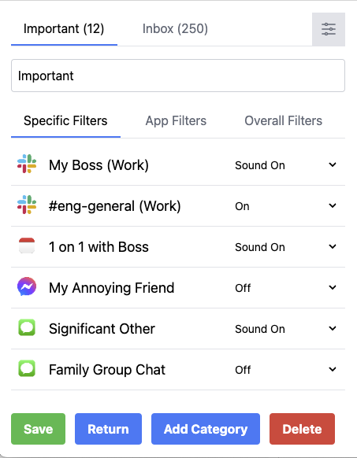

# NoTify - Stop getting distracted at Work!

## Table of Contents

1. [Introduction](#notify---stop-getting-distracted-at-work)
2. [The Problem with Slack](#you-wish-you-could-keep-slack-closed)
3. [Customizing My Notifications](#customizing-notifications-in-2023)
4. [NoTify - Fine-grained Control Over Your Notifications](#notify---fine-grained-control-over-your-notifications)
5. [How It Works](#how-it-works)
6. [User Guide](#user-guide)
7. [Interest Sign-Up Form](#interest-sign-up-form)

## You wish you could keep Slack closed

Yes, [Slack is your #1 distraction](https://www.forbes.com/sites/lucianapaulise/2023/05/04/yes-slack-is-your-1-distraction-here-is-how-to-improve-your-productivity/?sh=837f6db3bff8). [Slack is not where deep work happens](https://blog.nuclino.com/slack-is-not-where-deep-work-happens). [Slack is ruining work](https://www.wired.co.uk/article/slack-ruining-work). It has been described as [death by a thousand pings](https://medium.com/counter-intuition/the-hidden-side-of-using-slack-2443d9b66f8a).

Every developer has felt the pain of spending all day responding to notifications on Slack and not getting any actual coding done. So much so that we all often **turn off all notifications, close Slack, and enter 'focus mode'** to get work done.

But, eventually, Slack wins out and we end up opening the app again. Why? Because, perhaps we missed an important direct message from a manager or a project partner. But, often that isn't the case, yet we still proceed to spend time clicking through every unread channel and wading through notification hell.

Worst of all, there are 10 other apps like Gmail, iMessage, and Calendar that are all sending you notifications with varying degrees of importance.

## Customizing Notifications in 2023

Death by notification is such a problem for all of us that we've each come up with various half-baked solutions to deal with it! However, no matter what focus mode you customize, how many slack channels you mute, and how many apps you silence, those pesky notifications still come through or get blocked at seemingly the most inconvenient times.

And crucially, **you still periodically open Slack** and other apps because of that fear of missing out on something.

## NoTify - Fine-grained control over your notifications!

**That's why we built NoTify - to only allow the notifications that matter!**

Using NoTify ourselves has been such a breeze and we have become dependent on it to have those [real focus periods](https://www.getclockwise.com/blog/what-is-focus-time#:~:text=Focus%20Time%20is%20two%20or,give%20it%20your%20undivided%20attention) of work where we can go back to building. We cannot imagine a world without it.

## How It Works

We use your OpenAI API Key to filter out the notifications you receive and only alerting you about the stuff that matters. Never worry about having to constantly flip over to your inbox to see if that one important customer has responded yet so that you can [respond within 5 minutes](https://conversion-monster.com/lead-response-time/) - NoTify will recognize that they are important and notify you [loudly 🔊!](public/notification_sound.wav)

**You can tell NoTify exactly when to look out for something important in natural language!** Since you may have super specific needs on which messages you need to see immediately and which can wait, we created an intuitive interface through which you can inform NoTify how to adapt it's behavior. If you see a notification that shouldn't be important, simply modify your category descriptions by clicking on the settings button on the top right.

Instead of having your 2 chat apps, email, and custom alerting tools all open taking up a whole monitor on your desk, just keep NoTify open on the side! Think of it like an inbox for your notifications. As a bonus, if you hit Inbox 0 on your notifications, you will be rewarded with a nice picture for your diligence, and you can go back to coding in peace.

## User Guide

1. To use NoTify, download the product as follows:

- Download the app with this link: [notify-darwin-universal-1.0.4.zip](https://github.com/No-Tify/NoTify-desktop-releases/releases/download/v1.0.4-test-better-sqlite3-universal/notify-darwin-universal-1.0.4.zip)
- Double click the app (notify) to open!

2. Upon first opening the product, you should click the 'Filter' button in the top right, select your desired OpenAI Model, and save your OpenAI API KEY. If you do not have you you can make one by following the steps [here](https://www.howtogeek.com/885918/how-to-get-an-openai-api-key/). (_This will cost you some OpenAI API Credits, and send your computer's notifications to OpenAI's server - so make sure you are comfortable with the cost and security implications!_)

3. After that, the default customizations will already separate out your important notifications into your inbox. We recommend

   - muting notifications on a system level by [turning on](https://support.apple.com/en-gb/guide/mac-help/mchl999b7c1a/mac) "Do Not Disturb" so that you don't get double notified.
   - (_if possible_) Adding NoTify to 'Allowed Apps' in the Do Not Disturb focus (in System Settings > Focus > Do Not Disturb)!

4. Click on notifications to dismiss them! You can also use keyboard shortcuts to navigate (try pressing `space` to toggle keyboard mode on and off, and in this mode try `tab`, `j`, and `k` to navigate or `e` to dismiss the selected notification)

5. Congratulations! You have already gotten most of the way to filtering out all the clutter of notifications. The last step of the process is to add customizations, which you can do by clicking the settings button on the top right. These are all natural language, and we recommend just adding a new line with any rules you would like the app to follow.

   

<!-- You can also follow along in the video below -->

## Interest Sign-Up Form

Interested? [Join the Waitlist](https://docs.google.com/forms/d/e/1FAIpQLSeFzsNkiRDgDT6RgMnjCcpIzzF82qeuUyFZ-y5GwrHGcqL9hA/viewform?usp=sf_link) or email us at akshaj[DOT]kadaveru@gmail.com or sun[DOT]daniel[DOT]d@gmail.com
